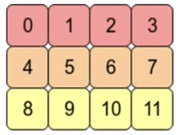

终于！神圣的Diffusion!

# Diffusion是如何运作的

> The sculpture is already complete within the marble block, before l start my work. lt isalready there, I just have to chisel away the superfluous material. 

这里Denoise的模块都是同一个，是在被反复地使用，但是这里每次输入的图像差距很大，只使用一个Denoise模块难免会力不从心，因此还有一个step的输入

## 参考资料

[扩散模型 - Diffusion Model【李宏毅2023】](https://www.bilibili.com/video/BV14c411J7f2/?spm_id_from=333.337.search-card.all.click&vd_source=32f9de072b771f1cd307ca15ecf84087)
[【学习笔记】生成模型——变分自编码器]()
