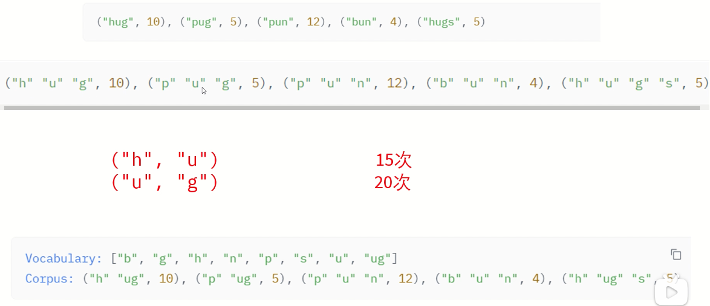
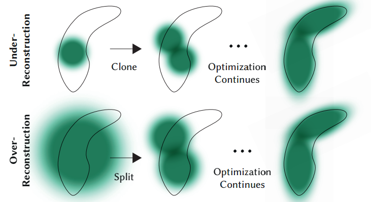

训练tokenizer更像是一种经典机器学习的统计模型,是确定性的，在代码中也是这样，更多的功夫要用在数据的处理和优化上。

# 关于训练一个Tokenizer

> [Q]：为什么要去训练一个Tokenizer？
> Tokenizer的训练是为了让其更好地适应特定的文本数据集和任务需求；在一些特定的任务中，默认的
> tokenizer可能对通用文本处理效果很好，但是当落实到特定的情况中时，会表现不是很好；因此
> tokenizer的训练可以使其学习到这些特定文本中独有的词汇，从而提高在特定任务中处理的准确性。


## 需要明确的几点基础知识

1. 首先要明确，目前我们训练tokenizer都是基于一个旧的tokenizer去训练一个新的tokenizer，
2. 训练的过程不涉及权重或者反向传播
- 如上图 tokenizer 的 processing pipeline 为
    - normalization  （这一步是为了将所有的txt文本转化成小写，并且去掉音调等）
    - pretokenization
    - tokenizer model
    - postprocesssing
- subword tokenization algorithms (subword: tokens are part of words) 会有可能把一个词分成多个子词，并有胰腺癌这几种算法，但是在此处
    - BPE: byte pair encoding
        - 迭代式地**添加**策略，不断地添加Token,直到达到我们指定的 target vocabulary size
    - word piece
    - unigram
        - 迭代式地**删除**策略，直到达到我们指定的 target vocabulary size

### BPE算法 Byte-Pair Encoding算法

字节对编码(BPE)算法最初是作为压缩文本的算法开发的，然后在预训练GPT模型时被OpenAI用于标记化。至今起仍然被很多Transformer架构的模型使用，包括GPT,GPT-2等等。

假设我们的语料库使用这五个词`["hug","pug","pun","hun","hugs"]`,这五个词的基本词汇表将是`["b","g","h","n","p","s","u"]`,

而pair(配对)就是针对基本词汇表中同时出现的词汇，统计他们同时出现的次数大小，如下图中，将ug配对之后放在了一起。




## 训练Tokenizer的简易代码

> 与微调大模型比较类似，训练tokenizer也是一套相对固定的代码范式

* **先是对这样一段python代码进行简单的tokenize，直观的看下效果**

```python
python_code = r'''def say_hello():
    print('Hello, World!')
    
# print hello
say_hello()
'''
print(python_code)
```

构建一个预训练的gpt2的Tokenizer模型

```python
tokenizer = AutoTokenizer.from_pretrained('gpt2') 
print(tokenizer(python_code)['input_ids'])    # 打印input_ids 
print(tokenizer(python_code).tokens())        # 打印tokens
```

代码输出为
```
[4299, 910, 62, 31373, 33529, 198, 220, 220, 220, 3601, 10786, 15496, 11, 2159, 0, 11537, 198, 220, 220, 220, 220, 198, 2, 3601, 23748, 198, 16706, 62, 31373, 3419, 198]
['def', 'Ġsay', '_', 'hello', '():', 'Ċ', 'Ġ', 'Ġ', 'Ġ', 'Ġprint', "('", 'Hello', ',', 'ĠWorld', '!', "')", 'Ċ', 'Ġ', 'Ġ', 'Ġ', 'Ġ', 'Ċ', '#', 'Ġprint', 'Ġhello', 'Ċ', 'say', '_', 'hello', '()', 'Ċ']
```
可以看出，上面的input_ids对应的是Embedding层中对应的行向量的id，下面的内容就是拆分出来的token。

> 无论学什么，都不能简单的看视频就完事了

* **下面是训练Tokenizer的关键步骤**

先是去加载一个合适的数据集

```python
from datasets import load_dataset
dataset = load_dataset(xxxxx) 
```

```python
iter_dataset = iter(dataset)  # 把数据转化为迭代的形式
tokenizer = AutoTokenizer.from_pretrained('gpt2')  # 构建预训练的模型
```

``` python 
new_tokenizer = tokenizer.train_new_from_iterator(batch_iterator(),  #这里是我们的对数据写的一个批次化的迭代器
                                                  vocab_size=12500, 
                                                  initial_alphabet=base_vocab)
```

针对这里的遍历，有两种比较常用的方式：

```python
# 方式一
def get_training_corpus():
    return (
        raw_datasets["train"][i : i + 1000]["whole_func_string"]
        for i in range(0, len(raw_datasets["train"]), 1000)
    )
training_corpus = get_training_corpus()

# 方式二（yield）
def get_training_corpus():
    dataset = raw_datasets["train"]
    for start_idx in range(0, len(dataset), 1000):
        samples = dataset[start_idx : start_idx + 1000]
        yield samples["whole_func_string"]
```
上面训练的过程可能是比较耗费时间，但是这样之后，一个简单的有监督训练的tokenizer就搭建好了😍


## 资料引用

[NLP从0到1之HuggingFace实战](https://zhuanlan.zhihu.com/p/657047389)
[五道口纳什up主的llm实践系列教程](https://www.bilibili.com/video/BV1Sk4y1P7LK)
[讲解BPE算法的视频](https://www.bilibili.com/video/BV1Ko4y1A7jN/?spm_id_from=333.337.search-card.all.click&vd_source=32f9de072b771f1cd307ca15ecf84087)