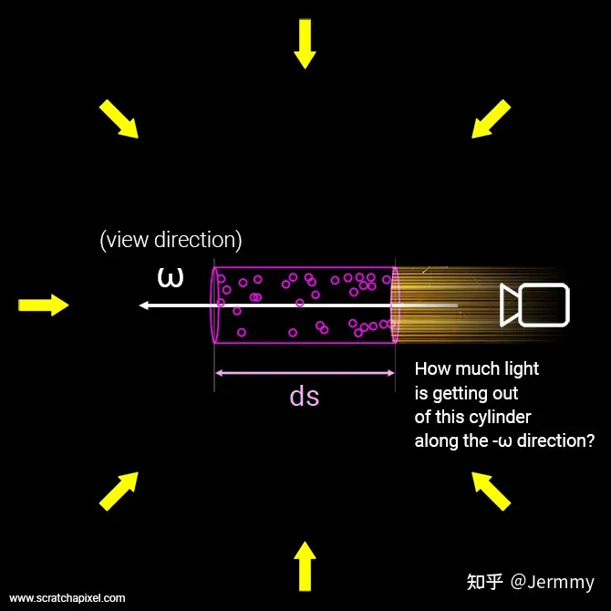
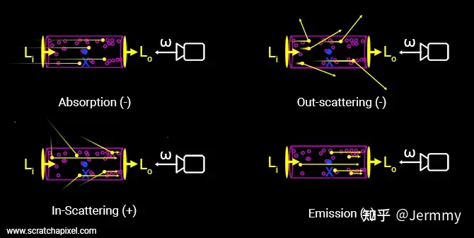
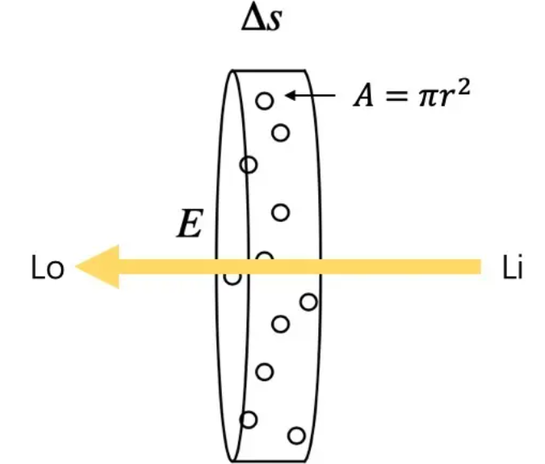

这篇博客是我在初步入门3dv看nerf这篇论文时候的记录

# Nerf

新视角合成

* **贡献1**：提出了5d的神经辐射场，利用5d的信息  加入了$\phi$和$\theta$两个 
* 体渲染技术，做可微渲染
* 使用位置编码将5维的输入转换到更高维的空间中去

## 体渲染公式

### 什么是渲染，什么又是体渲染？

* 渲染是图形学中的核心概念。
* 计算机图形学：让计算机模拟出一个真实的世界
* 渲染：则是把这个虚拟出来的世界投影成图像 ，正如**自然界中的各种光线经过碰撞后，投影到我们视网膜上的样子**

体渲染属于整个渲染技术的一个分支，它的目的主要是为了解决云、烟、果冻这类**非刚性**物体的渲染建模，可以简单理解为是为了处理密度较小的非固体的渲染，如果看下文还可以发现这可以推广到固体的渲染中

为了建模这种非刚性的物体的渲染，体渲染选择把**气体能物质抽象成一团飘忽不定的粒子群**。而光线在穿过这类物体时候，就是**光子与粒子发生碰撞**的过程。

光沿直线方向穿过一堆粒子 (粉色部分)，如果能计算出每根光线从最开始发射，到最终打到成像平面上的辐射强度，我们就可以渲染出投影图像。而体渲染要做的，就是对这个过程进行建模。为了简化计算，我们就假设光子只跟它附近的粒子发生作用，这个范围就是图中圆柱体大小的区间。

体渲染把光子与粒子发生作用的过程，进一步细化为四种类型：

* **吸收 (absorption)**：光子被粒子吸收，会导致入射光的辐射强度**减弱**；
* **放射 (emission)**：粒子本身可能发光，比如气体加热到一定程度就会离子化，变成发光的「火焰」。这会进一步**增大**辐射强度；
* **外散射 (out-scattering)**：光子在撞击到粒子后，可能会发生弹射，导致方向发生偏移，会**减弱**入射光强度；
* **内散射 (in-scattering)**：其他方向的光子在撞到粒子后，可能和当前方向上的光子重合，从而**增强**当前光路上的辐射强度。

上图中，$L_{i}$为入射的光，而$L_{o}$为出射的光

出射光与入射光之间的变化量，可以表示为这四个过程的叠加：

$$L_o-L_i=dL(x,w)=emission+inscattering-outscattering-absorption$$

#### 关于吸收

假设粒子都是半径为$r$的球体，那么每个粒子的投影面积是$A=\pi r^2$(也就是每个粒子对光线的遮挡面积),假设圆柱体中粒子的密度为$\rho$,圆柱体的底面积为$E$

当圆柱体足够薄 (薄到跟粒子一样厚) 的时候，可以认为粒子之间不会互相重叠 (也就是粒子都平铺在圆柱体一个横截面上)。

假定这个厚度是$\Delta s$,那么在这个厚度内圆柱体体积为$E\Delta s$,粒子的总数为$\rho E \Delta s$

这些粒子的遮挡的面积为$\rho E \Delta s A$,占整个底面积的比例为$\frac{\rho E \Delta s A}{E}$,也即，**当一束光通过这个圆柱体的时候，有$\rho \Delta s A$的概率会被遮挡。**

换句话说，如果我们在圆柱体的一端发射无数光线 (假设都朝相同的方向)，在另一端接收，会发现有些光线**安然通过**，有些则被粒子**遮挡** (吸收)。**但可以确定的是，这些接受到的光线总强度，相比入射光线总强度而言，会有$\rho \Delta s A$比例的衰减，即出射光的强度均值是入射光的$\rho \Delta s A$倍**

数学上可以表示为：

$$I_o-I_i=\Delta I=-\rho(s)AI(s)\Delta s$$

#### 关于放射

$$C(\mathbf{r})=\int_{t_n}^{t_f}T(t)\sigma(\mathbf{r}(t))\mathbf{c}(\mathbf{r}(t),\mathbf{d})dt,\mathrm{~where~}T(t)=\exp\!\left(-\int_{t_n}^t\sigma(\mathbf{r}(s))ds\right)$$

体渲染公式，是一个本来就存在的东西，其中$\mathbf{r}(t)=\mathbf{o}+t\mathbf{d}$

$$T\left(t\right)=\exp\left(-\int_{t_n}^{t}\sigma\left(\mathbf{r}\left(s\right)\right)\mathrm{d}s\right)$$

这里$T(t)$是指光随着距离衰减的程度，指的是，到达一个点之后，光强还剩下多少，同时这里的$\sigma$为粒子的密度大小，与颜色$c(.)$一样，他们都是在在面Nerf可以学习出来的值。

* **常微分方程**

体渲染公式 (9) 是一种很典型的常微分方程 (ordinary differential equation, ODE)。

所谓常微分方程，指的是方程中包括函数$y(x)$以及导数$y'(x)$，并且只包含一个变量$x$ 。如果只包含一阶导，则称为一阶常微分方程。

> 这里补充一些微分方程的知识(~~学高数~~)
>
> * **线性，齐次，系数为常数的**
>
> 最简单的一类常微分方程是这样$y^{\prime}(x)+\alpha y(x)=0$
>
> 求解过程为：
>
> $$\begin{aligned}
> \frac{y^{\prime}}{y}& =-\alpha   \\
> \int\frac{y^{\prime}}{y}dx& =-\int\alpha dx  \\
> \ln y+C& =-\alpha x  \\
> y(x)& =Ce^{-\alpha x} 
> \end{aligned}$$
>
> * **线性，齐次**
>
> 接下来升级一下，把常数替换为函数：$y'(x)+p(x)y(x)=0$
>
> 求解过程：
>
> $$\begin{aligned}
> \frac{y^{\prime}}{y}& =-p  \\
> \int\frac{y^{\prime}}{y}dx& =-\int pdx  \\
> \ln y& =-\int pdx+C  \\
> y(x)& =Ce^{\int p(x)dx} 
> \end{aligned}$$
>
> 
>
> 

### 

## 参考

[Neural Radiance Fields | 我起初心向明月 (zjwfufu.github.io)](https://zjwfufu.github.io/2023/08/04/神经辐射场/)

[NeRF入门之体渲染 (Volume Rendering) - 知乎 (zhihu.com)](https://zhuanlan.zhihu.com/p/595117334)
