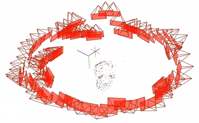

在漫威的Snap卡牌游戏中，升级卡牌的方式是这样的，2D->打破边框->3D->动画....


# Nerf

> Nerf的整体思路是像素坐标系---->相机坐标系---->世界坐标系 


新视角合成

* **贡献1**：提出了5d的神经辐射场，利用5d的信息  加入了$\phi$和$\theta$两个 
* **贡献2**: 体渲染技术，做可微渲染
* **贡献3**: 使用位置编码将5维的输入转换到更高维的空间中去

## 关于体渲染公式

### 什么是渲染，什么又是体渲染？

* 渲染是图形学中的核心概念。
* 计算机图形学：让计算机模拟出一个真实的世界
* 渲染：则是把这个虚拟出来的世界投影成图像 ，正如**自然界中的各种光线经过碰撞后，投影到我们视网膜上的样子**

体渲染属于整个渲染技术的一个分支，它的目的主要是为了解决云、烟、果冻这类**非刚性**物体的渲染建模，可以简单理解为是为了处理密度较小的非固体的渲染，如果看下文还可以发现这可以推广到固体的渲染中

为了建模这种非刚性的物体的渲染，体渲染选择把**气体能物质抽象成一团飘忽不定的粒子群**。而光线在穿过这类物体时候，就是**光子与粒子发生碰撞**的过程。


光沿直线方向穿过一堆粒子 (粉色部分)，如果能计算出每根光线从最开始发射，到最终打到成像平面上的辐射强度，我们就可以渲染出投影图像。而体渲染要做的，就是对这个过程进行建模。为了简化计算，我们就假设光子只跟它附近的粒子发生作用，这个范围就是图中圆柱体大小的区间。

体渲染把光子与粒子发生作用的过程，进一步细化为四种类型：

* **吸收 (absorption)**：光子被粒子吸收，会导致入射光的辐射强度**减弱**；
* **放射 (emission)**：粒子本身可能发光，比如气体加热到一定程度就会离子化，变成发光的「火焰」。这会进一步**增大**辐射强度；
* **外散射 (out-scattering)**：光子在撞击到粒子后，可能会发生弹射，导致方向发生偏移，会**减弱**入射光强度；
* **内散射 (in-scattering)**：其他方向的光子在撞到粒子后，可能和当前方向上的光子重合，从而**增强**当前光路上的辐射强度。


上图中，$L_{i}$为入射的光，而$L_{o}$为出射的光

出射光与入射光之间的变化量，可以表示为这四个过程的叠加：

$$L_o-L_i=dL(x,w)=emission+inscattering-outscattering-absorption$$

#### 关于吸收


假设粒子都是半径为$r$的球体，那么每个粒子的投影面积是$A=\pi r^2$(也就是每个粒子对光线的遮挡面积),假设圆柱体中粒子的密度为$\rho$,圆柱体的底面积为$E$

当圆柱体足够薄 (薄到跟粒子一样厚) 的时候，可以认为粒子之间不会互相重叠 (也就是粒子都平铺在圆柱体一个横截面上)。

假定这个厚度是$\Delta s$,那么在这个厚度内圆柱体体积为$E\Delta s$,粒子的总数为$\rho E \Delta s$

这些粒子的遮挡的面积为$\rho E \Delta s A$,占整个底面积的比例为$\frac{\rho E \Delta s A}{E}$,也即，**当一束光通过这个圆柱体的时候，有$\rho \Delta s A$的概率会被遮挡。**

换句话说，如果我们在圆柱体的一端发射无数光线 (假设都朝相同的方向)，在另一端接收，会发现有些光线**安然通过**，有些则被粒子**遮挡** (吸收)。**但可以确定的是，这些接受到的光线总强度，相比入射光线总强度而言，会有$\rho \Delta s A$比例的衰减，即出射光的强度均值是入射光的$\rho \Delta s A$倍**

数学上可以表示为：

$$I_o-I_i=\Delta I=-\rho(s)AI(s)\Delta s$$

#### 关于放射

> 高中物理的某一章节一定讲过，“粒子本身是会发光的”，这里的发光就是指粒子本身的放射。

这里我们假设一个粒子发射一束光的辐射强度为$I_{e}$,那么按照前文的描述，在粒子足够薄的情况下，粒子总数是$\rho AE\Delta s$,那么其总的发光强度为$I_e \rho AE\Delta s$。

如果我们在圆柱体一端去接收粒子们放射的光线，会发现有时候能接收到，有时候刚好接收点所在的光路上没有粒子，就接收不到。能接收到光线的概率为$\rho AE\Delta s/E=\rho A\Delta s$,其接收到的平均的光强度为$I_e\rho A\Delta s$。

#### 关于外散射

> 为什么Nerf的作者在建模时候可以想到这么多啊

粒子除了吸收光子，也可能会弹射光子，这个过程称为外散射，即光子被弹射出原本的光路，导致光线强度减弱，这个过程的具体影响之后再说(目前情况太复杂了，已经是纯纯的物理建模了)。

### 体渲染公式引入

* 在了解了上述的基本知识后，我们终于可以引入体渲染公式了

$$C(\mathbf{r})=\int_{t_n}^{t_f}T(t)\sigma(\mathbf{r}(t))\mathbf{c}(\mathbf{r}(t),\mathbf{d})dt,\mathrm{~where~}T(t)=\exp\!\left(-\int_{t_n}^t\sigma(\mathbf{r}(s))ds\right)$$

体渲染公式，是一个本来就存在的东西，其中$\mathbf{r}(t)=\mathbf{o}+t\mathbf{d}$

$$T\left(t\right)=\exp\left(-\int_{t_n}^{t}\sigma\left(\mathbf{r}\left(s\right)\right)\mathrm{d}s\right)$$

这里$T(t)$是指光随着距离衰减的程度，指的是，到达一个点之后，光强还剩下多少，同时这里的$\sigma$为粒子的密度大小，与颜色$c(.)$一样，他们都是在在面Nerf可以学习出来的值。

值得一提的是，如果有耐心的话，是可以通过上面的物理建模将体渲染公式推导出来的，但是时间太有限，加上本人物理和数学基础十分差,因此建议参考这一篇[NeRF入门之体渲染 (Volume Rendering)](https://zhuanlan.zhihu.com/p/595117334)


* 体渲染公式是一种很典型的常微分方程 (ordinary differential equation, ODE)。

> 所谓常微分方程，指的是方程中包括函数$y(x)$以及导数$y'(x)$，并且只包含一个变量$x$ 。如果只包含一阶导，则称为一阶常微分方程。
> 这里补充一些微分方程的知识(~~复习高数~~)
>
> * **线性，齐次，系数为常数的**
>
> 最简单的一类常微分方程是这样$y^{\prime}(x)+\alpha y(x)=0$
>
> 求解过程为：
>
> $$\begin{aligned}
> \frac{y^{\prime}}{y}& =-\alpha   \\
> \int\frac{y^{\prime}}{y}dx& =-\int\alpha dx  \\
> \ln y+C& =-\alpha x  \\
> y(x)& =Ce^{-\alpha x} 
> \end{aligned}$$
>
> * **线性，齐次**
>
> 接下来升级一下，把常数替换为函数：$y'(x)+p(x)y(x)=0$
>
> 求解过程：
>
> $$\begin{aligned}
> \frac{y^{\prime}}{y}& =-p  \\
> \int\frac{y^{\prime}}{y}dx& =-\int pdx  \\
> \ln y& =-\int pdx+C  \\
> y(x)& =Ce^{\int p(x)dx} 
> \end{aligned}$$
>

看完上面的这些知识，会出现一个问题，就是会觉得体渲染公式是无法通过正常的方式得到解的，如果这么想就是想对了，因此在计算机中为获得相应的解，我们选择将体渲染公式进行离散化。

#### 体渲染公式的离散化

我们将整个光路$[0,s]$划分为$N$个相等间距的区间：$N \times [t_{n},t_{n+1}]$。那么，只要能算出每个区间$[t_{n},t_{n+1}]$内的辐射强度$I(t_n\to t_{n+1})$ ，最后把这$N$个区间的辐射加起来，就可以得到最终的光线强度了。$N$越大，也即离散的程度越大，则越接近理论数值

## Nerf中所用的Trick

### Trick1-位置编码

位置编码运用了低频的特性，给神经网络输入一个低频的东西，输出也会是一个比较低频的东西；对于神经网络来说，输入就是这个点的x,y,z坐标还有这个点的方向角，例如$(0,0,0)$和$(0,10,0)$之间的差距其实就是低频的，通过神经网络输出的结果也是低频的，也就是差距不会很大，渲染出来的颜色比较平滑，相邻的颜色差距很小；

$$\gamma(p)^{\mathfrak{k}}=\left(\sin(2^0\pi p),\cos(2^0\pi p),\cdots,\sin(2^{L-1}\pi p),\cos(2^{L-1}\pi p)^{^{\prime}}\right)$$

利用这种位置编码，我们就可以把输入变成一个高频的东西，如果是原来非常相邻的两个点，经过这样的一个表示就会变得非常不一样。此处的$p$指的是$(x,y,z)$，一般只对空间位置进行，而不会对方向角进行，因此被成为空间位置编码。

### Trick2-分级采样(View Dependence)

解决问题：点的采样是一个均匀采样，均匀采样会导致一个问题，在$t_{near}$到$t_{far}$的距离中，有很多点是空气点，采样出来的密度就是0，而在体渲染公式中是一累乘的连续形式，而这样的均匀采样又会不可避免的采样到这种空气地方。

作者的解决方案：分两步走，首先用等间隔采样(均匀采样方式)去训练得到一个Nerf，然后Nerf可以在这条光线上绘制出其$\sigma$的变化曲线出来，得到这个变化曲线之后，就可以按照密度去采样，可以在$\sigma$比较小的地方，用很小的采样点，在$\sigma$比较大的地方，用较多的采样点，去做比较精细的采样。在代码中则是一个是粗网络，一个是细网络。

### 相机成像知识补充

* **世界坐标系与虚拟坐标系**

世界坐标系是我们规定好的一个点，而相机坐标系是在世界坐标系中随机规划好的一个点；
同一个点，这里规定世界坐标系里表示为$(X_w,Y_w,Z_w,1)$,规定在相机坐标系里表示是$(X_c,Y_c,Z_c,1)$,世界坐标到相机坐标的变换可以使用齐次坐标的矩阵形式表示为：

$$\begin{bmatrix}X_c\\Y_c\\Z_c\\1\end{bmatrix}=\begin{bmatrix}R_{11}&R_{12}&R_{13}&T_x\\R_{21}&R_{22}&R_{23}&T_y\\R_{31}&R_{32}&R_{33}&T_z\\0&0&0&1\end{bmatrix}\begin{bmatrix}X_w\\Y_w\\Z_w\\1\end{bmatrix}$$

其中的$\begin{bmatrix}R_{11}&R_{12}&R_{13}&T_x\\R_{21}&R_{22}&R_{23}&T_y\\R_{31}&R_{32}&R_{33}&T_z\\0&0&0&1\end{bmatrix}$这个4x4的矩阵为相机的外参数(相机的位置和相机的倾斜角度)，可以在外界获取，然后这个矩阵也是可逆的，代表我们可以利用世界坐标去求相机坐标

## 代码运行

在下载好数据集之后，我们运行命令`python run_nerf.py --config configs/fern.txt`，如果看到下面的输出，代表正常运行：

```
(CMS2) dell@dell-Precision-7920-Tower:/mnt/data/CMS/OSR/code2/111/nerf-pytorch$ python run_nerf.py --config configs/fern.txt
/home/dell/anaconda3/envs/CMS2/lib/python3.9/site-packages/torch/__init__.py:614: UserWarning: torch.set_default_tensor_type() is deprecated as of PyTorch 2.1, please use torch.set_default_dtype() and torch.set_default_device() as alternatives. (Triggered internally at ../torch/csrc/tensor/python_tensor.cpp:451.)
  _C._set_default_tensor_type(t)
Loaded image data (378, 504, 3, 20) [378.         504.         407.56579161]
Loaded ./data/nerf_llff_data/fern 16.985296178676084 80.00209740336334
recentered (3, 5)
[[ 1.0000000e+00  0.0000000e+00  0.0000000e+00  1.4901161e-09]
 [ 0.0000000e+00  1.0000000e+00 -1.8730975e-09 -9.6857544e-09]
 [-0.0000000e+00  1.8730975e-09  1.0000000e+00  0.0000000e+00]]
Data:
(20, 3, 5) (20, 378, 504, 3) (20, 2)
HOLDOUT view is 12
Loaded llff (20, 378, 504, 3) (120, 3, 5) [378.     504.     407.5658] ./data/nerf_llff_data/fern
Auto LLFF holdout, 8
DEFINING BOUNDS
NEAR FAR 0.0 1.0
Found ckpts []
get rays
done, concats
shuffle rays
done
Begin
TRAIN views are [ 1  2  3  4  5  6  7  9 10 11 12 13 14 15 17 18 19]
TEST views are [ 0  8 16]
VAL views are [ 0  8 16]
```

同时，我们来看一下在GTX 4090上的显存占用情况：

```
+---------------------------------------------------------------------------------------+
| NVIDIA-SMI 535.161.07             Driver Version: 535.161.07   CUDA Version: 12.2     |
|-----------------------------------------+----------------------+----------------------+
| GPU  Name                 Persistence-M | Bus-Id        Disp.A | Volatile Uncorr. ECC |
| Fan  Temp   Perf          Pwr:Usage/Cap |         Memory-Usage | GPU-Util  Compute M. |
|                                         |                      |               MIG M. |
|=========================================+======================+======================|
|   0  NVIDIA GeForce RTX 4090        Off | 00000000:73:00.0  On |                  Off |
| 85%   64C    P2             300W / 450W |   3705MiB / 24564MiB |     72%      Default |
|                                         |                      |                  N/A |
+-----------------------------------------+----------------------+----------------------+
|   1  NVIDIA GeForce RTX 4090        Off | 00000000:A6:00.0 Off |                  Off |
| 48%   37C    P8              27W / 450W |     21MiB / 24564MiB |      0%      Default |
|                                         |                      |                  N/A |
+-----------------------------------------+----------------------+----------------------+
                                                                                         
+---------------------------------------------------------------------------------------+
| Processes:                                                                            |
|  GPU   GI   CI        PID   Type   Process name                            GPU Memory |
|        ID   ID                                                             Usage      |
|=======================================================================================|
|    0   N/A  N/A      1574      G   /usr/lib/xorg/Xorg                           35MiB |
|    0   N/A  N/A     58950      G   /usr/lib/xorg/Xorg                          156MiB |
|    0   N/A  N/A     59096      G   /usr/bin/gnome-shell                         75MiB |
|    0   N/A  N/A     59789      G   /usr/local/sunlogin/bin/sunloginclient       12MiB |
|    0   N/A  N/A     59876      G   /usr/lib/firefox/firefox                     14MiB |
|    0   N/A  N/A    214596      C   python                                     3364MiB |
|    1   N/A  N/A      1574      G   /usr/lib/xorg/Xorg                            4MiB |
|    1   N/A  N/A     58950      G   /usr/lib/xorg/Xorg                            4MiB |
+---------------------------------------------------------------------------------------+
```

可以看到在一张4090上只占用了不超过4个G的显存，总体还是十分友好的。


读取数据时，打印其中的命令行参数结果为：
```
Namespace(config='configs/fern.txt', expname='fern_test', basedir='./logs', datadir='./data/nerf_llff_data/fern', netdepth=8, netwidth=256, netdepth_fine=8, netwidth_fine=256, N_rand=1024, lrate=0.0005, lrate_decay=250, chunk=32768, netchunk=65536, no_batching=False, no_reload=False, ft_path=None, N_samples=64, N_importance=64, perturb=1.0, use_viewdirs=True, i_embed=0, multires=10, multires_views=4, raw_noise_std=1.0, render_only=False, render_test=False, render_factor=0, precrop_iters=0, precrop_frac=0.5, dataset_type='llff', testskip=8, shape='greek', white_bkgd=False, half_res=False, factor=8, no_ndc=False, lindisp=False, spherify=False, llffhold=8, i_print=100, i_img=500, i_weights=10000, i_testset=50000, i_video=50000)
```

## “使用”Nerf
> 学习他，理解他，使用它

我拍摄了一组关于Mr.misses(没错，就是瑞克与莫蒂里的那个万能小人)的照片(使用辣鸡相机素质的meizu20进行拍摄)，手机拍摄时候需要注意一点，就是在相机里调整到固定的焦段，然后再进行拍摄。



然后按照网上的教程(有很多，这里不列举了)，大致的流程都是：导入colmap-->得到位姿信息-->输入Nerf-->渲染得到最终效果

### 最终效果展示 

<video width="320" height="240" controls>
    <source src="/images/hardware/uav/视频.mp4" type="video/mp4">
</video>

可以看到重建效果有，但是前一半时间的关注点似乎是错了，后半段视频的效果还挺不错，有空重新拍个别的试一试效果。

## 参考

[Neural Radiance Fields 我起初心向明月 (zjwfufu.github.io)](https://zjwfufu.github.io/2023/08/04/神经辐射场/)

[NeRF入门之体渲染 (Volume Rendering) - 知乎 (zhihu.com)](https://zhuanlan.zhihu.com/p/595117334)

