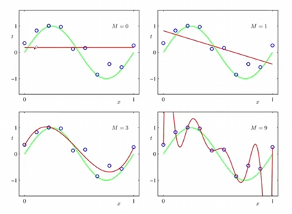
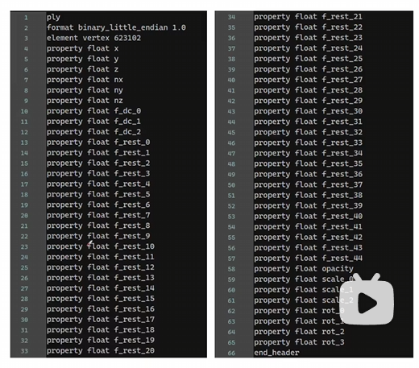

听群友这样说，在3dv 2024会议上，3DGS一作讲论文的时候NeRF一作进来发现没位置了，还被关门外了

# 3D Gaussian Splatting

## 整体的框架


> SFM，structure from motion，中文直译名就是运动恢复结构，可以重建稀疏点云的和相机参数(内外)，其应用最多的场景还是用于标定**相机的内外参数**，这也是为什么我们可以直接从视频中进行抽帧的原因。

<!-- * **用文字来表达这个重建流程就是：**
1. 先得到一堆稀疏的点云（colmap中对于位姿信息的估计）
2. 根据这些初始化的点云生成三维高斯的椭球集。
3. 将三维高斯的椭球集从世界的坐标投影到平面的相机上去,进行**光栅化**（光栅化就是从3维投影到2维）
4. 根据渲染公式 -->

## 初始稀疏点云

与NeRF中相同，我们首先要使用colmap进行创建一个稀疏的初始化的点云，如下图所示，通过一组图片去计算每一组图片的位姿，从而最后得到一些稀疏的关键点云；

有意思的是，这里生成的点云只是3DGS中场景中初始化默认的一些点，由于后续还会有梯度回传到点云里，因此这里点云甚至可以**随机初始化**出来，就是可能导致收敛时间更长了些。


## 3D高斯椭球集的创建----位置与形状

位置信息：点云位置信息优化,也就是$(x,y,z)$，即高斯椭球的中心点均值$\mu$

形状信息：高斯椭球的协方差矩阵$\Sigma$,$\Sigma$包含高斯椭球的旋转矩阵$R$和在各个轴的缩放矩阵$S$，其中$\Sigma = RSS^TR^T$。

<!-- 这里之所以这么设计 -->

## 3D高斯椭球集的创建----颜色与不透明度

颜色信息：点云颜色$(r,g,b)$----使用球谐函数来表示，使得点云在不同的角度会呈现不同的颜色，而且有利于提高迭代的效率(在代码中使用4阶来表示)

不透明度信息：点云的不透明度，密度优化$\alpha$

## 关于球谐函数

球谐函数可以看作是一种多项式的拟合(泰勒展开式)，在多项式的拟合中，表达能力会随着阶数的能力的提升而提高；例如$f(x) = ax^3+bx^2+cx^1+dx^0$中，$x^3,x^2,x^1,x^0$分别代表基函数。



而傅里叶级数的展开，其实就是使用了$sinx$和$cosx$这样的基函数去拟合出不同的周期函数。而球谐函数，就是一个用在球面上的基函数，用于去拟合球面上不停变换的离散的值，其阶数越高，表达能力会越强。


球谐函数是什么我们先不用管，先了解球谐函数只与$\theta$和$\phi$有关，


> “这玩意直接拟合三维点云不就有密集三维模型了吗”

对这些球谐函数的基函数进行加权组合，得到球面上的一组函数，从而有效地将离散的数据转化为连续的数据。

在3DGS中，点云颜色$(r,g,b)$是使用球谐函数来表示的，使得**点云在不同的角度可以呈现不同的颜色**，并且这样有利于提高迭代的效率。


在3DGS的实际过程中，点云颜色使用了4阶的球谐函数进行表示，$n$阶球谐函数的参数量为$n^2$，如果是R,G,B三个值，那么就是3*16,一共有48个属性，组合之后，可以将离散的颜色数据转化为连续的颜色数据，同时有利于对参数进行迭代

## 3D高斯椭球集的创建



其中`element vertex`是跑出来多少点数，然后每个点拥有下面这六十行的属性，其中`(x,y,z)`是位置信息，也就是中心点`\mu`，`(nx,ny,nz)`是指法向量信息，但是好像没有用到？从`f_dc_0`到`f_dc_2`是代表每个高斯分布的颜色RGB的球谐系数(SH)以及(`f_rest_0` 到 `f_rest_44`)，一共是3+45个属性，平均到每个RGB就是16个属性。`opacity`就是不透明度信息$\alpha$，`scale_0`,`scale_1`,`scale_2`就是三个方向的缩放矩阵，也即协方差矩阵的参数，从`rot_0`到`rot_3`是旋转矩阵，使用旋转四元数(一个实部和三个虚部来组成的)来进行表示。

## 计算机图形学投影矩阵

<!-- ....没看懂，后面再补充 -->

## 渲染公式

首先回顾**NeRF的体渲染公式**，连续的是这个样子，在[这一篇blog](https://cfcys.github.io/posts/2024/01/blog-3dv1/)我们相对详细地讨论了这个：

$$
C=\sum_{i=1}^NT_i(1-\exp(-\sigma_i\delta_i))\mathbf{c}_i\quad\mathrm{with}\quad T_i=\exp\left(-\sum_{j=1}^{i-1}\sigma_j\delta_j\right)
$$

离散化之后是这样的：

$$
C=\sum_{i=1}^NT_i\alpha_i\mathbf{c}_i,\quad\text{with}\quad\alpha_i=(1-\exp(-\sigma_i\delta_i)) \text{and} T_i=\prod_{j=1}^{i-1}(1-\alpha_i)
$$

在NeRF中，是通过对生成的射线上进行点的采样得到，但是在3DGS中，也是基于类似的这样基于"点"的方法，也即通过点云中一定的半径范围中能影响像素的N个**有序的点**来计算一个像素的颜色$c$:

$$
C=\sum_{i\in N}c_{i}\alpha_{i}\prod_{j=1}^{i-1}(1-\alpha_{j})
$$

其中,$a_{i}$代表当前点i的不透明度(密度)值，$a_{j}$代表$i$之前的点的不透明度值，使用$1-a_{j}$的累乘，作为权重`weight`，这实际是代表**前面的点越透明，这个weight会越大，当前a_{i}的影响权重**就会越大。

## 损失Loss定义

与NeRF相同，其损失函数定义同样十分简单：

$$\mathcal{L}=(1-\lambda)\mathcal{L}_1+\lambda\mathcal{L}_\text{D-SSIM}$$

其中L1损失与NeRF中的类似，用于评价重建前后的损失情况，D-SSIM是一个类似的评价图像质量损失的loss函数。

## 基于梯度自适应改变点云的分布方式

> 每隔100个epoch会去判断点云的分布是否是合理的。

- Pruning掉一些透明度很高的点，或者离相机比较近的一些点
- 过度重构和欠采样(基于**梯度**来进行判断)
  - 如果是过度重构，方差(?)很小，通过克隆高斯来适应  （ Under-Reconstruction
  - 如果是欠采样，方差很大，就通过分割高斯来进行适应 （ Over-Reconstruction
  

 

# 3DGS原理剖析

整体推导的思路可以清晰地描述如下：

* 对采样后**整个场景**的操作，都可以归结为对重建核进行操作。
 
* 每个椭圆的位置与颜色坐标是无关的，也即每个椭球的颜色与位置是无关的；

* 高斯分布经仿射变换后或者边缘分布之后仍是高斯分布，这完美符合了我们对重建核函数的要求


## 对采样后整个场景的操作，都可以归结为对重建核进行操作。

一系列喀喀喀的证明

##  Derivation of Splatting

Nerf中是一个旋转变换加一个平移变换，一个矩阵就够了
但是在splatting中，这个过程是反过来的，是把物体投影到平面上。STEP1中仍然是将源空间（世界坐标系）下的坐标转换到相机空间（一步经典的仿射变换），


# 3DGS代码解析

## Rander函数的过程
这部分的重点在与怎么把一个个3d的椭球投影到平面上

针对于每个像素，投影到高斯上的像素的数量是不一样的，**因此无法使用pytorch来很好的将这个东西进行平行化（细品一下）。**

# 使用3DGS！

个人感觉，如果想获得高质量的重建效果，最好还是从视频中，尤其是使用无人机稳定的航拍视频进行连续地抽帧，这样进行重建，效果一般都很不错。

这里写一下进行视频抽帧的代码，在windows平台上需要使用ffmpeg这个工具，其处理的命令是：

```bash
ffmpeg -i {视频地址} -qscale:v 1 -qmin 1 -vf fps={fps} %04d.jpg
```

* 效果展示：

我制作了一个[在线导览3d重建的网站](https://cfcys.github.io/paper/3dv4/demo.html)，这个网站同样挂载在我的blog上，此外推荐在配有GPU的电脑上点开这个网页，会有更流畅的体验。
## 参考资料

* [知乎：简单入门资料](https://zhuanlan.zhihu.com/p/680669616)
* [哔哩哔哩：中恩实验室教程，十分好的教程](https://www.bilibili.com/video/BV1FC4y1k79X/?spm_id_from=333.788&vd_source=32f9de072b771f1cd307ca15ecf84087)