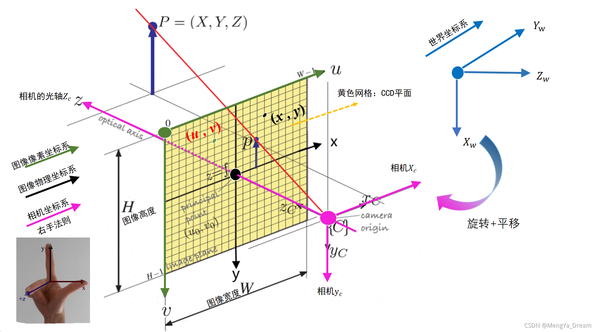
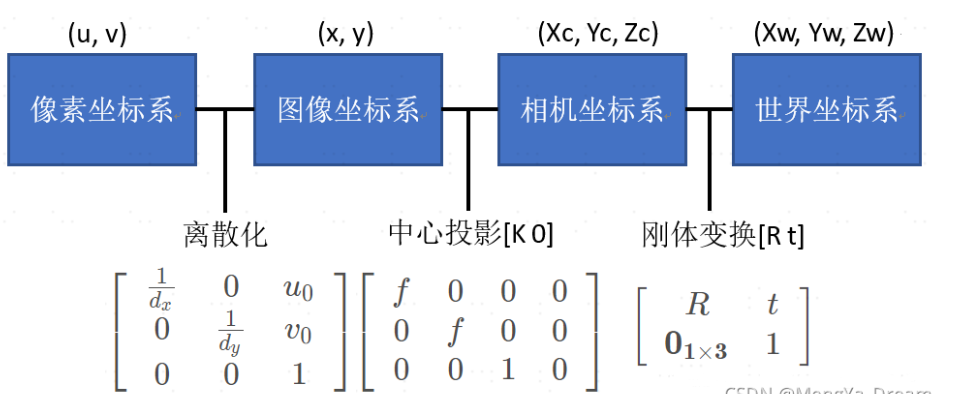

这篇blog补充一些相机成像，坐标转换balabala的知识

# 线性变换

* 什么是线性变换

我首次接触这个概念是在线性代数的课程中，不过当时大多是$y = ax+b$一带而过；

# 世界坐标系-相机坐标系

世界坐标系可以很简单的被理解为世界范围内的某个点$(x_{w},y_{w},y_{w})$，而相机坐标系

## c2w与w2c

# 图像坐标系

# 像素坐标系

## 参考资料

[马同学资料，超好的可视化👍！](https://www.matongxue.com/madocs/244/)