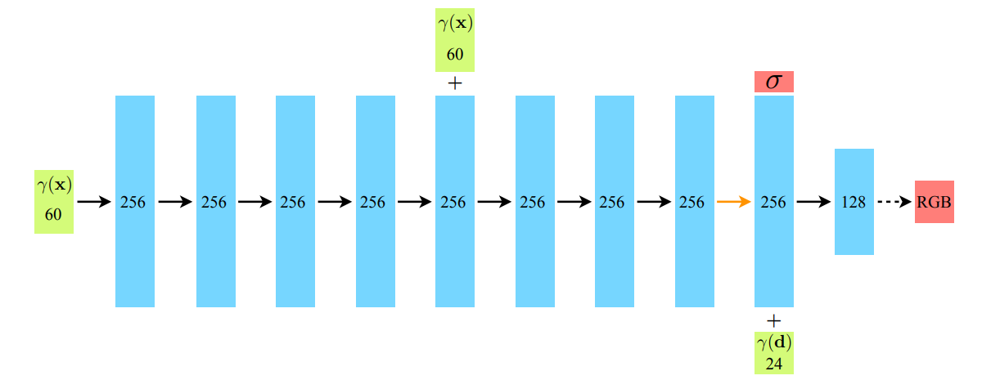
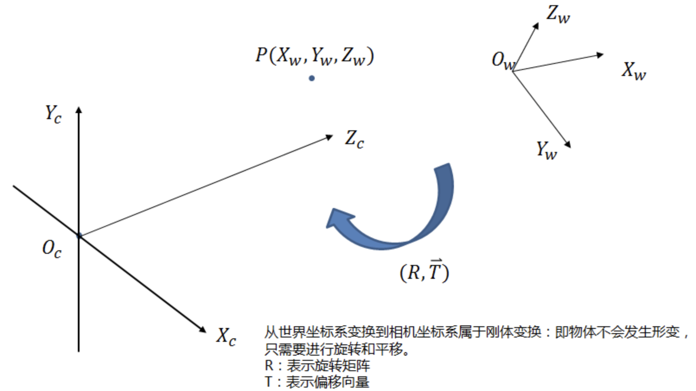
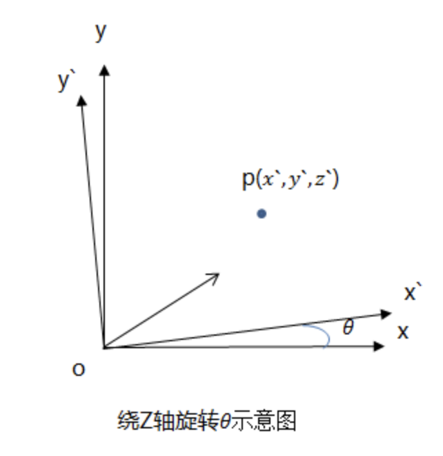

这篇blog补充一些3dv中相机成像，坐标转换balabala的知识

# 线性变换

* 什么是线性变换

我首次接触这个概念是在线性代数的课程中，不过当时大多是$y = ax+b$一带而过，但至少我们明白了线性变换公式中的$a$和$b$都是对应的矩阵；

# 世界坐标系&相机坐标系

> 该转换可以被直接地理解为一个线性变换$x_{c} = R * x_{w} + T$，更是一种典型的仿射变换，因此更熟练的人会直接把世界坐标系到相机坐标系的转换称之为仿射变换（“硬拉！”）

世界坐标系可以很简单的被理解为世界范围内的某个点$(x_{w},y_{w},z_{w})$，而相机坐标系则是以相机的光心（相机凸透镜的中心）为原点的坐标系$(x_{c},y_{c},z_{c})$

因此，可以将相机坐标系与世界坐标系的转化简单地总结为旋转和平移的进行，其中负责旋转的是$R$,负责平移的是$T$。

* **旋转**

由上图可知，经过一个$\theta$的旋转的具体的坐标转化为：

$$
\begin{cases}x=x'cos\theta-y'sin\theta\\y=x'sin\theta+y'cos\theta\end{cases}
$$

在三维的情况下，我们可以把**总体旋转的情况分成围绕固定的三个坐标轴旋转一定角度的情况**，
例如由$\begin{cases}x=x'cos\theta-y'sin\theta\\y=x'sin\theta+y'cos\theta\\z=z\end{cases}$, 可以推导出：

$$
\begin{bmatrix}x\\y\\z\end{bmatrix}=\begin{bmatrix}cos\theta&-sin\theta&0\\sin\theta&cos\theta&0\\0&0&1\end{bmatrix}\begin{bmatrix}x'\\y'\\z'\end{bmatrix}=R_1\begin{bmatrix}x'\\y'\\z'\end{bmatrix}
$$

此处的$R_{1}$即为z轴固定情况下的旋转矩阵，同理，可以简单的推导出绕x轴和绕y轴分别旋转$\varphi$和$\omega$情况下3维旋转矩阵$R_{2},R_{3}$:

$$
\begin{bmatrix}x\\y\\z\end{bmatrix}=\begin{bmatrix}1&0&0\\0&cos\varphi&sin\varphi\\0&-sin\varphi&cos\varphi\end{bmatrix}\begin{bmatrix}x\\y\\1\end{bmatrix}=R_2\begin{bmatrix}x\\y\\z\end{bmatrix}
$$

$$
\begin{bmatrix}x\\y\\z\end{bmatrix}=\begin{bmatrix}cos\varphi&0&-sin\varphi\\0&1&0\\sin\varphi&0&cos\varphi\end{bmatrix}\begin{bmatrix}x\\y\\1\end{bmatrix}=R_3\begin{bmatrix}x\\y\\z\end{bmatrix}
$$

因此，总的旋转矩阵为：

$$
R = R_{1}R_{2}R_{3}
$$

* **偏移**

基于之前的变换，我们只需为$(x,y,z)$每个维度添加一些一些偏移量$(T_{1},T_{2},T_{3})$,此时，就变成了典型的“$y=ax+b$”的形式：

$$
\begin{bmatrix}X_c\\Y_c\\Z_c\end{bmatrix}=R\begin{bmatrix}X_w\\Y_w\\Z_w\end{bmatrix}+T
$$

更为常见的一种表述是这样的：

$$
\begin{bmatrix}X_c\\Y_c\\Z_c\\1\end{bmatrix}=\begin{bmatrix}R&T\\\vec{0}&1\end{bmatrix}\begin{bmatrix}X_w\\Y_w\\Z_w\\1\end{bmatrix},\text{R:3*3,T:3*1}
$$

> 熟悉3dv的人应该都知道这里是相机的内参表示，但是具体📷是怎么获取这个相机内参，在相机的视角中，世界坐标系又是怎样确定的呢？

# 图像坐标系与图像坐标系

# 像素坐标系

## 参考资料

[马同学资料，超好的可视化👍！](https://www.matongxue.com/madocs/244/)
[超级细致的CSDN资料](https://blog.csdn.net/lyhbkz/article/details/82254069)