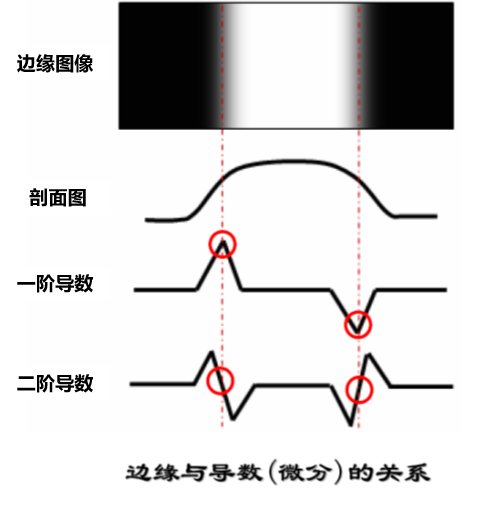

记录一些数字图像处理的知识

## 图像边缘检测

### 边缘

* **边缘**存在于目标与背景、目标与目标、区域与区域之间，是图像最基本的特征之一,为人们描述或识别目标以及解释图像提供了一个重要的特征参数。
* **边缘**常常意味着一个区域的终结和另一个区域的开始，是**图像局部特征不连续**的表现。
* 图像边缘有**方向**和**幅度**两个特征。
* 如果能成功地检测出图像的边缘，图像分析、图像识别就会方便得多，精确度也会得到提高。

### 边缘检测的基本思想


<!--  -->

在边缘的**一阶导数**中，幅度峰值一般对应的就是边缘的位置。在图像由暗变亮的突变位置有一个整的峰值，而在图像由亮变暗的位置会有一个负的峰值，在其他的位置都为0，因此可以使用**一阶导数的幅度值来检测边缘的存在**。

或者，我们也可以使用二阶导数的中的**过零点**来检测边缘的存在。

### 边缘检测的基本步骤


<!--  -->

* **滤波**：边缘检测算法主要是基于图像强度的一阶和二阶导数，但导数的计算对噪声很敏感，因此必须使用滤波器来改善与**噪声有关**的边缘检测器的性能。

> **大多数滤波器在降低噪声的同时也导致了边缘强度的损失，因此，增强边缘和降低噪声之间需要折中。**

* **增强：**增强边缘的基础是**确定图像各点邻域强度的变化值**。增强算法可以将邻域(或局部)强度值有显著变化的点突显出来。边缘增强一般是**通过计算梯度幅值来完成的**。
* **检测：**在图像中有许多点的梯度幅值比较大，而这些点在特定的应用领域中并不都是边缘，所以应该用某种方法来确定哪些点是边缘点。最简单的边缘检测判据是梯度幅值阈值判据。
* **定位：**如果某一应用场合要求确定边缘位置，则边缘的位置可在子像素分辨率上来估计，边缘的方位也可以被估计出来。

### 利用算子去计算导数

一阶导数：通过**梯度算子**进行计算。

二阶导数：通过**Laplacian算子**进行计算。

### **Roberts**梯度算子法

**Roberts**梯度算子法属于一阶导数的梯度算子计算，其实就是采用对角方向相邻两像素之差，故也称为**4点差分法**。其水平和垂直方向的梯度定义为： 


$$
\begin{cases}G_h(m,n)=f(m,n)-f(m-1,n-1)\\G_v(m,n)=f(m,n-1)-f(m-1,n)\end{cases}
$$

写成矩阵的梯度模板可表示为:

$$
W_h=\begin{pmatrix}-1&0&0\\0&1&0\\0&0&0\end{pmatrix}\quad W_v=\begin{pmatrix}0&-1&0\\1&0&0\\0&0&0\end{pmatrix}
$$

**特点**是：用4分点进行差分以求得梯度，方法简单。缺点是对噪声较敏感，常用于不含噪声的图像边缘点检测。

#### **Roberts**实现代码

```python
import cv2
import numpy as np
from scipy import ndimage
import matplotlib.pyplot as plt

# 读取图片
image = cv2.imread('aaa.jpg')

# 将图片转换为灰度图
gray_image = cv2.cvtColor(image, cv2.COLOR_BGR2GRAY)

# Roberts算子
roberts_cross_v = np.array([[1, 0],
                            [0, -1]])

roberts_cross_h = np.array([[0, 1],
                            [-1, 0]])

# 使用卷积应用Roberts算子
vertical_edges = ndimage.convolve(gray_image, roberts_cross_v)
horizontal_edges = ndimage.convolve(gray_image, roberts_cross_h)

# 计算边缘强度
edge_magnitude = np.sqrt(np.square(horizontal_edges) + np.square(vertical_edges))

# 转换到0-255范围
edge_magnitude *= 255.0 / edge_magnitude.max()

# 使用matplotlib显示原图和边缘检测结果
plt.figure(figsize=(10, 5))
plt.subplot(121), plt.imshow(cv2.cvtColor(image, cv2.COLOR_BGR2RGB)), plt.title('Original Image')
plt.subplot(122), plt.imshow(edge_magnitude, cmap='gray'), plt.title('Edge Detection')
plt.show()
```

#### **Roberts**检测效果


### **平滑梯度算子法（平均差分法）**

平滑梯度算子方法有两种

* **Prewitt**梯度算子法（平均差分法）

​因为**平均能减少或消除噪声**，Prewitt梯度算子法就是先求平均，再求差分来计算梯度。它的水平和垂直梯度模板分别为：

$$
\begin{array}{rcl}W_{h}&=&\frac{1}{3}\begin{pmatrix}-1&0&1\\-1&0&1\\-1&0&1\end{pmatrix}&&W_{\nu}&=&\frac{1}{3}\begin{pmatrix}-1&-1&-1\\0&0&0\\1&1&1\end{pmatrix}\end{array}
$$

利用检测模板可求得水平和垂直方向的梯度，再通过梯度合成和边缘点判定，即可得到平均差分法的检测结果。

* **Sobel**算子法

**Sobel**算子就是对当前行或列对应的值加权后，再进行平均和差分，也称为加权平均差分。水平和垂直梯度模板分别为：

$$
W_h=\frac14\begin{pmatrix}-1&0&1\\-2&0&2\\-1&0&1\end{pmatrix}\quad W_\nu=\frac14\begin{pmatrix}-1&-2&-1\\0&0&0\\1&2&1\end{pmatrix}
$$

**Sobel****算子和**Prewitt**算子一样，都在检测边缘点的同时具有抑制噪声的能力，检测出的边缘宽度至少为二像素。由于它们都是先平均后差分，平均时会丢失一些细节信息，使边缘有一定模糊。但由于**Sobel**算子的加权作用，其使边缘模糊的程度要低于**Prewitt**算子。

#### Prewitt梯度算子边缘检测代码

```python
import cv2
import numpy as np
from scipy import ndimage
import matplotlib.pyplot as plt

# 读取图片
image = cv2.imread('aaa.jpg')

# 将图片转换为灰度图
gray_image = cv2.cvtColor(image, cv2.COLOR_BGR2GRAY)

# Prewitt算子
prewitt_vertical = np.array([[-1, 0, 1],
                             [-1, 0, 1],
                             [-1, 0, 1]]) * (1/3)

prewitt_horizontal = np.array([[-1, -1, -1],
                               [0, 0, 0],
                               [1, 1, 1]]) * (1/3)

# 使用卷积应用Prewitt算子
vertical_edges = ndimage.convolve(gray_image, prewitt_vertical)
horizontal_edges = ndimage.convolve(gray_image, prewitt_horizontal)

# 计算边缘强度
edge_magnitude = np.sqrt(np.square(horizontal_edges) + np.square(vertical_edges))

# 转换到0-255范围
edge_magnitude *= 255.0 / edge_magnitude.max()

# 使用matplotlib显示原图和边缘检测结果
plt.figure(figsize=(10, 5))
plt.subplot(121), plt.imshow(cv2.cvtColor(image, cv2.COLOR_BGR2RGB)), plt.title('Original Image')
plt.subplot(122), plt.imshow(edge_magnitude, cmap='gray'), plt.title('Edge Detection')
plt.show()
```

#### Prewitt梯度算子试验效果


#### Sobel梯度算子边缘检测代码

```python
import cv2
import numpy as np
import matplotlib.pyplot as plt

# 读取图片
image = cv2.imread('aaa.jpg')

# 将图片转换为灰度图
gray_image = cv2.cvtColor(image, cv2.COLOR_BGR2GRAY)

# Sobel算子的参数
scale = 1
delta = 0
ddepth = cv2.CV_16S

# 计算x方向上的梯度
grad_x = cv2.Sobel(gray_image, ddepth, 1, 0, ksize=3, scale=scale, delta=delta, borderType=cv2.BORDER_DEFAULT)

# 计算y方向上的梯度
grad_y = cv2.Sobel(gray_image, ddepth, 0, 1, ksize=3, scale=scale, delta=delta, borderType=cv2.BORDER_DEFAULT)

# 计算两个方向的梯度的绝对值
abs_grad_x = cv2.convertScaleAbs(grad_x)
abs_grad_y = cv2.convertScaleAbs(grad_y)

# 合并梯度（近似）
edge_magnitude = cv2.addWeighted(abs_grad_x, 0.5, abs_grad_y, 0.5, 0)

# 使用matplotlib显示原图和边缘检测结果
plt.figure(figsize=(10, 5))
plt.subplot(121), plt.imshow(cv2.cvtColor(image, cv2.COLOR_BGR2RGB)), plt.title('Original Image')
plt.subplot(122), plt.imshow(edge_magnitude, cmap='gray'), plt.title('Edge Detection')
plt.show()
```


#### Sobel梯度算子试验效果


