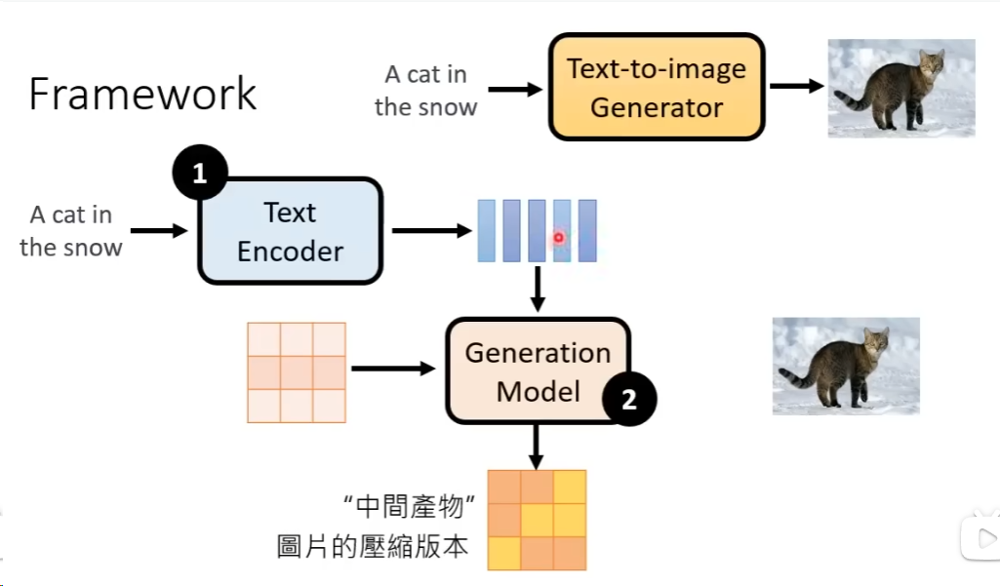

消费者无意识地被支配性的、从一个商品走向另一个商品，在今天的消费社会中，人们从来不
消费**物的本身**，人们总是把物用来当做能够突出自我的符号。

我在使用购买来获取我存在的意义和价值，似乎，在购买中，我获得了自己那鲜有的自我价值，但是必须承认，这是一种极为廉价，快速的获取方式。

不断的决策是很费精力，因此，这也是为什么我会在舍友问我决定几点洗澡时候感到厌烦（或许我对他有些刻薄了

现代人之所以会发挥大把的银子去国外旅游等，这正是因为其相信了“浪漫的消费主义神话”，消费主义告诉我们：想要快乐，就要去购买更多的产品，更好的服务；

看不破会带来痛苦，看破了会常采虚无，所以这是我感到虚无的原因？

大部分生活中你认为放松且免费的事物，切实**既不放松，也不免费**

解决疲劳的最好的方式，就是在复杂的世界中，偶尔做一个傻瓜，把精力留给真正需要的事情。

推动硅谷建立的，不是计算机工程师，而是热爱社交的风险投资人。

自己之前觉得舍友说的都是没用的话这类的想法都是不对的，社交中，本来大部分的话都是无用的，自己的心胸太小了，会耽误事情的。

**你是，与你相处时间最多的五个人，所带来的平均值** 按照这个话来说，我与我的父母，舍友。。。。

什么才算是强连接呢？

不要依赖熟悉的人去提升自己。 不要依赖不熟的人去证明自己。

强连接是自我表露循序渐进之后的结果。“不愿意分享自己的脆弱，总是觉得自己要保持一个完美的状态，觉得身边的人过分矫情，”

在强连接中起航，在弱连接中成长，在孤独中**消亡**，